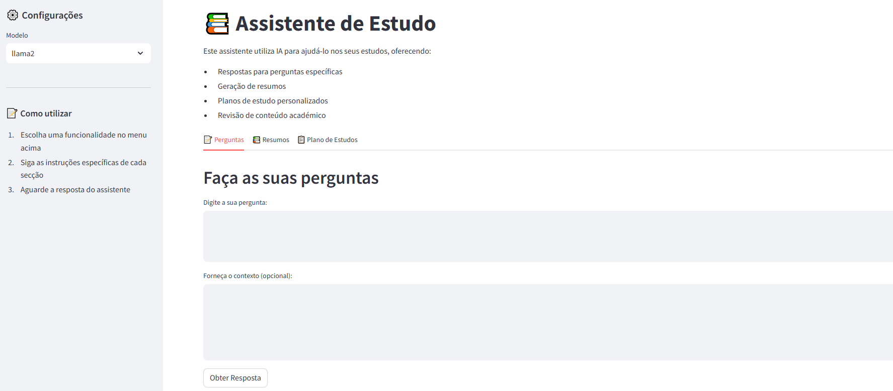

# Assistente de Estudo com Ollama



Uma aplicação que utiliza modelos de linguagem local (via Ollama) para auxiliar estudantes nos estudos. Responde a perguntas, gera resumos e cria planos de estudo.

## Funcionalidades

- 💡 Respostas a perguntas sobre matérias específicas
- 📝 Gera resumos
- 📚 Revisão de conteúdo académico
- 🎯 Sugestões de estudo personalizadas

## Requisitos

- Python 3.11+
- Ollama instalado e em execução local
- Modelo Llama2 ou Mistral descarregado no Ollama

## Instalação

1. Clone o repositório:
```bash
git clone [URL_DO_REPOSITÓRIO]
cd [NOME_DO_DIRETÓRIO]
```

2. Crie e ative o ambiente virtual:
```bash
python -m venv venv
.\venv\Scripts\activate  # Windows
source venv/bin/activate  # Linux/Mac
```

3. Instale as dependências:
```bash
pip install -r requirements.txt
```

4. Instale o Ollama:
- Windows: [Instruções de instalação do Ollama](https://github.com/ollama/ollama)
- Linux/Mac: 
```bash
curl https://ollama.ai/install.sh | sh
```

5. Descarregue o modelo Llama2:
```bash
ollama pull llama2
```

## Execução

1. Inicie o Ollama:
```bash
ollama serve
```

2. Noutro terminal, inicie a aplicação:
```bash
streamlit run app.py
```

A aplicação estará disponível em `http://localhost:8501`

## Estrutura do Projeto

```
.
├── app.py                 # Aplicação principal Streamlit
├── backend/              
│   ├── __init__.py
│   ├── ollama_client.py   # Interface com Ollama
│   └── study_utils.py     # Funções de processamento de estudo
├── utils/               
│   ├── __init__.py
│   └── helpers.py        # Funções auxiliares
├── static/              # Ficheiros estáticos
├── requirements.txt     # Dependências
└── README.md           # Documentação
```

## Tecnologias Utilizadas

- [Streamlit](https://github.com/streamlit/streamlit) - Framework para desenvolvimento rápido de aplicações web
- [Ollama](https://github.com/ollama/ollama) - Framework para executar LLMs localmente
- [Llama2](https://github.com/facebookresearch/llama) - Modelo de linguagem open-source